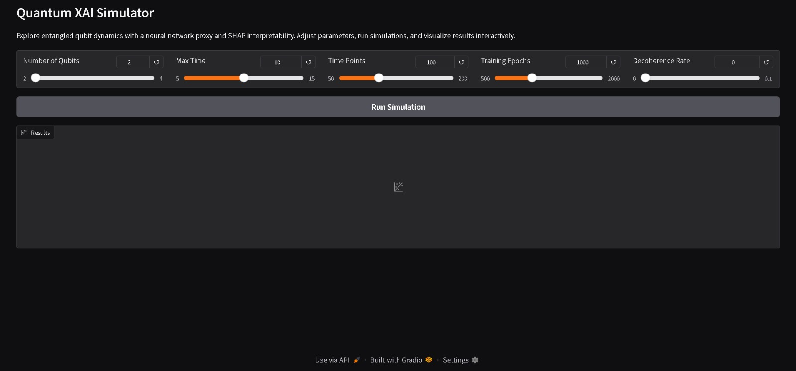

# Quantum XAI Mini-App

An interactive tool for exploring **quantum dynamics** with machine learning and explainable AI (XAI).  
It simulates entangled qubits, trains a neural network to approximate the dynamics, and applies **SHAP analysis** to interpret the results.  
The app runs with [Gradio](https://gradio.app/) in a simple web interface, no prior quantum expertise required.

---

## Features
- Simulate **2-4 qubits** with tunable parameters (time, epochs, decoherence, etc.).
- Train a **PyTorch neural network** in real-time.
- Apply **SHAP explainability** to visualize feature impact.
- Dashboard with:
  - Training loss curve  
  - Quantum vs NN prediction comparison  
  - SHAP beeswarm plot  
  - Run summary (MSE, parameters)  

---

## Installation

Clone this repository:

```bash
git clone https://github.com/ShaharyarNasir/Quantum-XAI-App.git
cd quantum-xai-app
```

Install dependencies:

```bash
pip install -r requirements.txt
```

---

## Run the App

Start the Gradio app:

```bash
python quantum_xai_app.py
```

This will open a local web interface in your browser.

---

## Example

When you run a simulation (e.g., 2 qubits, 1000 epochs), the app shows an interactive dashboard:

1. Training loss over epochs  
2. Quantum correlation vs. NN prediction  
3. SHAP summary plot  
4. Simulation summary with MSE and parameters  



---

## Citation

If you use this app in your research or teaching, please cite:

```bibtex
@misc{quantum_xai_app,
  title        = {Quantum XAI Mini-App: Interactive Exploration of Quantum Dynamics with Neural Networks and SHAP},
  author       = {Muhammad Shaharyar Nasir},
  year         = {2025},
  howpublished = {\url{https://github.com/ShaharyarNasir/Quantum-XAI-App.git},
  note         = {Interactive Gradio-based implementation accompanying research paper}
}
```

---

## License
MIT License - feel free to use, modify, and share.
